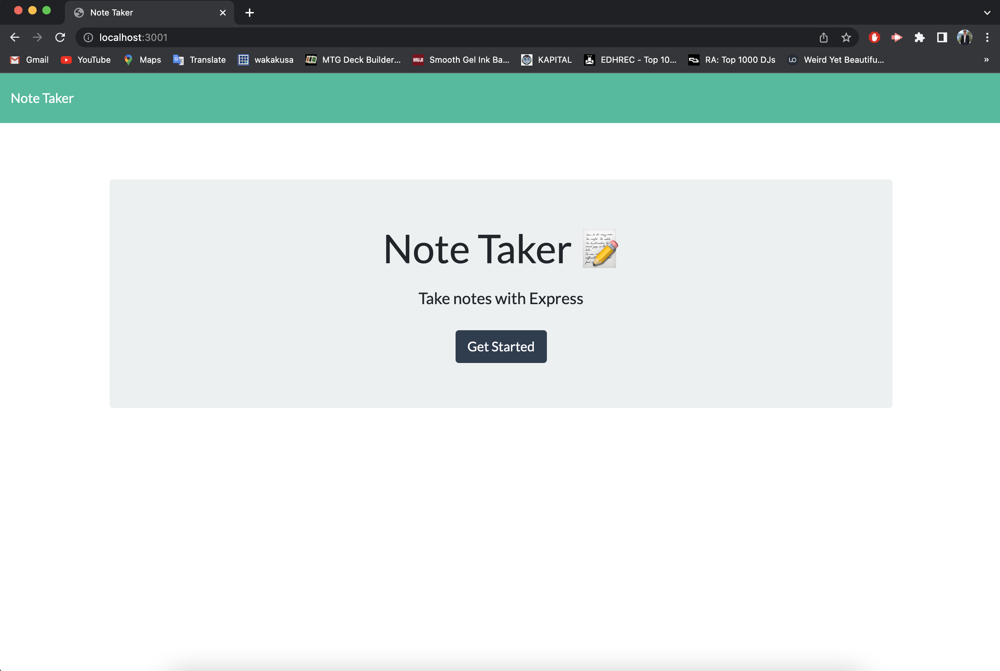
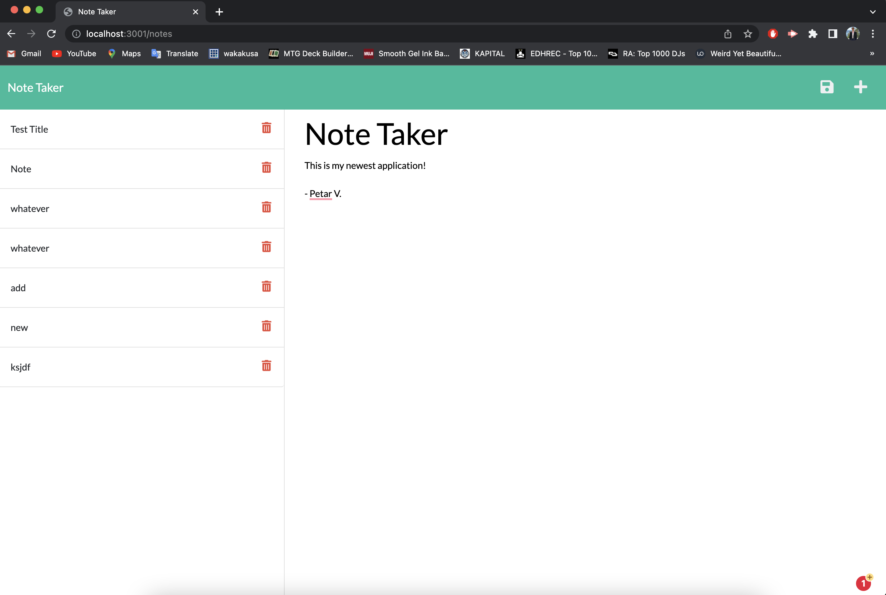
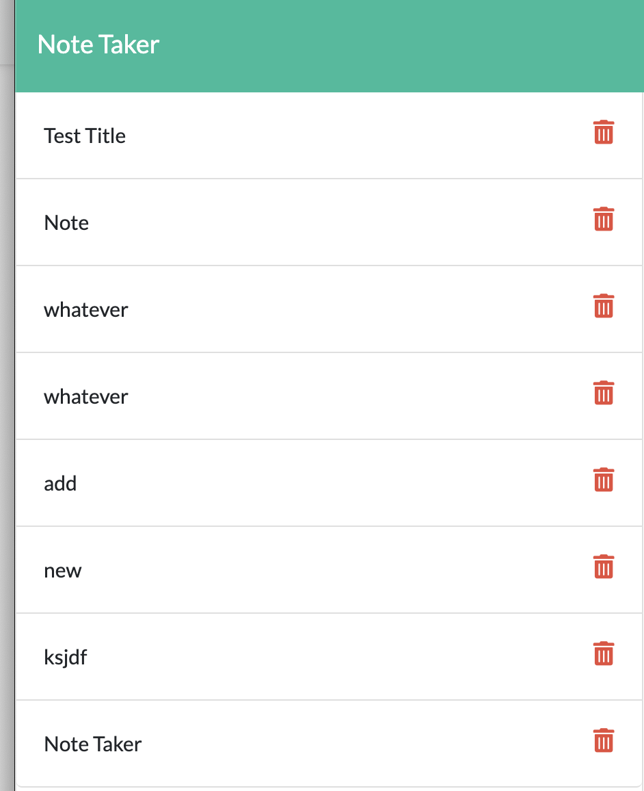

# Note-Taker

This application includes front-end starter code for a note taking application that was connected with back-end code using node, npm, express.js, and deployed through heroku. 

-----
## Capability
Users are able to write new notes and save them to their local device. New notes end up being displayed on the left hand side of the webpage with their assigned title. 

------

## Links
https://github.com/prvapalacinka/Note-Taker

https://prvapalacinka.github.io/Note-Taker/

http://localhost:3001/api/notes

## Image

